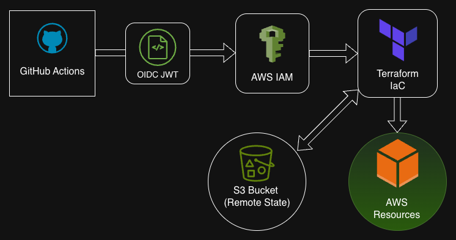
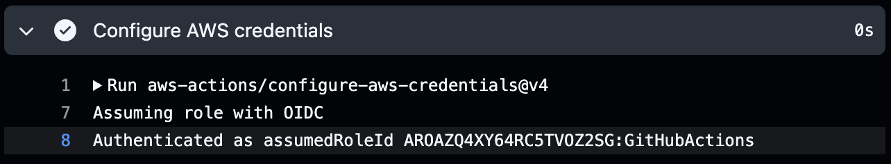

# Secure AWS CI/CD Pipeline via GitHub OIDC

## Project Overview

A hardened deployment pipeline that automates AWS infrastructure provisioning using **GitHub Actions** and **Terraform**. This project demonstrates a **Zero-Trust** approach to CI/CD by eliminating the need for long-lived, insecure static AWS Access Keys.

---

## The Security Problem: Static Keys

Traditional CI/CD pipelines often store `AWS_ACCESS_KEY_ID` and `AWS_SECRET_ACCESS_KEY` as GitHub Secrets.

- **The Risk:** If these keys are leaked, an attacker has permanent access to your cloud environment until the keys are manually rotated.
- **The Solution:** Using **OpenID Connect (OIDC)**, GitHub requests a short-lived, temporary token from AWS that is only valid for the duration of the specific job.

### Security Comparison: Static Keys vs. OIDC

| Feature              | Static Access Keys (Old Way)      | GitHub OIDC (Current Way)           |
| :------------------- | :-------------------------------- | :---------------------------------- |
| **Credential Life**  | Permanent (until manual rotation) | **Short-lived (expires after job)** |
| **Storage Location** | GitHub Actions Secrets            | **No keys stored in GitHub**        |
| **Authentication**   | Shared Secret (Key/ID)            | **Identity-based Trust (JWT)**      |
| **Attack Surface**   | High (Leaked keys = Full access)  | **Low (Scoped to Repo & Branch)**   |
| **Maintenance**      | High (Requires rotation policy)   | **Zero (Automated by AWS/GitHub)**  |

---

## Architecture Diagram



The workflow begins with GitHub Actions requesting a short-lived token via OIDC. Once the IAM Role is assumed, the runner gains the necessary permissions to execute Terraform commands, which interact with AWS APIs to provision and manage resources securely.

---

## Key Features

- **Zero-Secret Authentication:** Eliminated hardcoded secrets by leveraging GitHub’s OIDC IdP to exchange a JSON Web Token (JWT) for short-lived AWS STS credentials.
- **Infrastructure as Code (IaC):** Utilized **Terraform** to ensure reproducible, version-controlled infrastructure deployments.
- **Scoped Trust Policies:** Hardened the IAM Role by using `StringLike` conditions in the trust relationship, ensuring only specific GitHub repositories and branches can assume the role.
- **Remote State & Locking:** Implemented an S3 backend with **DynamoDB state locking** to prevent state corruption and allow for secure, collaborative infrastructure management.

---

## Tech Stack

- **Cloud:** AWS (IAM, S3, OIDC)
- **CI/CD:** GitHub Actions
- **IaC:** Terraform
- **Languages:** HCL (HashiCorp Configuration Language), YAML

---

## Implementation Highlights

### 1. GitHub Actions Workflow

Code block highlighting the 'permissions' and 'jobs' sections from the workflow file.

> _Additional steps can be configured to perform whatever actions are needed but aren't included here since they aren't the focus of the project_

```yaml
name: OIDC Authentication
on: [push]

permissions:
  id-token: write # This is required for requesting the JWT
  contents: read # This is required for actions/checkout

jobs:
  terraform:
    runs-on: ubuntu-latest

    steps:
      - name: Checkout # clone repo onto the runner
        uses: actions/checkout@v4

      - name: Configure AWS credentials
        uses: aws-actions/configure-aws-credentials@v4
        with:
          # Scoped IAM Role ARN
          role-to-assume: arn:aws:iam::123456789012:role/GitHubActionsWorkflowRole
          aws-region: us-east-1
```

### 2. AWS IAM Trust Relationship

To enforce the **Principle of Least Privilege**, the IAM Role is configured with a trust policy that only accepts requests from this specific GitHub repository. This prevents unauthorized repos from attempting to assume the role.

```json
{
	"Version": "2012-10-17",
	"Statement": [
		{
			"Effect": "Allow",
			"Principal": {
				"Federated": "arn:aws:iam::123456789012:oidc-provider/token.actions.githubusercontent.com"
			},
			"Action": "sts:AssumeRoleWithWebIdentity",
			"Condition": {
				"StringEquals": {
					"token.actions.githubusercontent.com:aud": "sts.amazonaws.com"
				},
				"StringLike": {
					"token.actions.githubusercontent.com:sub": "repo:my-github-account/oidc-authentication:*"
				}
			}
		}
	]
}
```

### 3. Successful Handshake

> _Screenshot of the GitHub Actions console showing the "Configure AWS Credentials" step finishing successfully._
> 

---

## Lessons Learned

- **Identity Federation:** Learned how to configure AWS as a Relying Party for GitHub’s OIDC Identity Provider, moving away from legacy IAM user management.
- **Granular Permission Scoping:** Proficiency in the use of **Condition Keys** (`token.actions.githubusercontent.com:sub`) to enforce the Principle of Least Privilege, restricting access to the specific repo and environment.
- **OIDC Claims & Scopes:** Understood the necessity of the `id-token: write` permission in GitHub Actions to allow the runner to fetch the OIDC token required for the handshake.
- **CI/CD Security Hardening:** Evaluated the trade-offs between self-hosted and GitHub-hosted runners regarding security and credential management.

---

## Repository Structure

- `.github/workflows/`: GitHub Action definition files.
- `terraform/`: HCL files for AWS infrastructure.
- `README.md`: Documentation.
